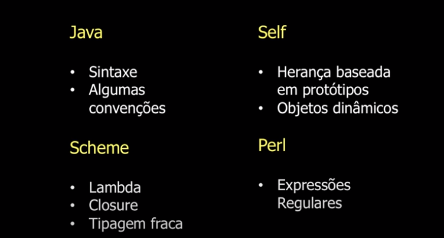

# Javascript

## O que é?
É uma linguagem de programação de alto nível, leve, interpretada e orientada a objetos. Foi criada principalmente para rodar nos navegadores e manipular os comportamentos de páginas web. Por exemplo, podemos adicionar estilos CSS por meio do Javascript.

Foi criada por Brengan Eich, tomando como base o Java, Scheme, Self e até Perl.



Seu primeiro nome foi Mocha, mas este nem chegou ao mercado. Em 1995 a Netscape lançou a linguagem com o nome de LiveScript, pois a empresa já tinha outros produtos que utilizavam o prefixo **Live**.

Em dezembro seu nome mudou para JavaScript após uma união da Netscape com a Sun, então detentora da linguagem Java.

No ano de 1997 a Netscape conseguiu padronizar a linguagem junto a ECMA Internacional e a linguagem foi novamente renomeada para ECMAScript, que é o seu nome oficial.

### Principais características:
* É interpretada, ou seja, não precisamos instalar nada.
* É orientada a objetos.
* Tipagem fraca e dinâmica.
* Possui funções de primeira classe.

### Para que serve?
* Desenvolvimento web: utilidade básica da linguagem.
* Desenvolvimento desktop: utilizando o *framework* [Electron](https://www.electronjs.org/docs).
* Desenvolvimento mobile: utilizando *frameworks* como [Ionic](https://ionicframework.com/docs/intro/cli) e [React Native](https://reactnative.dev/docs/getting-started).
* Desenvolvimento backend: com o uso de [NodeJS](https://nodejs.org/en/docs/).
* Desenvolvimento de jogos: com o uso do Phaser.

## Variáveis
* As variáveis possuem tipagem fraca, devem começar por uma letra, cifrão($) ou *underline*(_). Após a primeira letra podemos conter números.
* Por conversão, devemos seguir o padrão camelCase.
* São case-sensitive.
* Tipagem dinâmica.

```javascript
var x;   //undefined
x = 0;   //number
x = '0'; //string
```

### Principais tipos

* Boolean para valores lógicos (verdadeiro ou falso).
* Number: para números.
* String: para textos.
* null: palavra-chave para valores nulos.
* undefined: quando o valor da propriedade é indefinido.
* Object: para objetos compostos de vários campos.

```javascript
var boolano = true;
var numero = 23;
var texto = 'String';
var nulo = null;
var indefinido = undefined;
var objeto = { nome: "meu nome" };
```

Recentemente também foi adicionado o tipo Symbol.

No exemplo acima, temos a variável objeto que é um tipo composto. Com ela, podemos guardar objetos complexos de dados. Por exemplo, para capturarmos o valor do nome, poderíamos seguir as seguintes abordagens: 
```javascript
objeto.nome;
objeto['nome'];
```

Para adicionar novas propriedades ao objeto podemos seguir as seguintes abordagens:
```javascript
objeto.novaPropriedade = 1;
objeto['novaPropriedade'] = 1;
```

Caso na inicialização de um objeto tenhamos uma variável cujo nome seja igual ao nome da propriedade que queremos adicionar, podemos seguir a seguinte abordagem:
```javascript
var nome = 'Pedro';
var pessoa = {
    nome
};
//var pessoa = {
//    nome: nome
//};
```
Vale lembrar que está implementação foi adicionada em uma das versões mais recentes do Javascript.

Outro exemplo de implementação adicionada em versões recentes é uma nova maneira de criar variáveis string:
```javascript
var nome = 'Pedro';
var sobrenome = 'Silva';
var pessoa = `${nome} ${sobrenome}`; // Pedro Silva
```

Podemos ainda criar **Arrays**. O objeto Array do JavaScript é um objeto global usado na construção de 'arrays': objetos de alto nível como listas.

```javascript
var carros = ['Civic', 'Corolla'];
carros[0]; // Civic

var pessoas = [{ nome: 'Marcos' }, { nome: 'Maria' }];
pessoas[1]; // { nome: 'Maria' }
pessoas[1].nome; // Maria
```


### Declarações
* **var**: declara uma variável podendo inicializá-la ou não.
* **let**: declara uma variável local de escopo do bloco, podendo inicializá-la ou não.
* **const**: declara uma constante de escopo do bloco apenas leitura.

## Operadores

### Atribuição
Atribui um valor ao operando à esquerda.

```javascript
var x = y;
var x += y; // x = x + y - atribuição de adição
var x -= y; // x = x - y - atribuição de subtração
var x *= y; // x = x * y - atribuição de multiplicação
var x /= y; // x = x / y - atribuição de divisão
```

### Comparação
Retorna um valor lógico com base na comparação dos operadores.

* **Igual (==)**: retorna verdadeiro se os valores são iguais.
* **Não igual (!=)**: retorna verdadeiro se os valores não são iguais.
* **Estritamente igual (===)**: retorna verdadeiro se os valores são iguais e do mesmo tipo.
* **Estritamente não igual (!==)**: retorna verdadeiro se os valores não são iguais ou não são do mesmo tipo.
* **Maior (>)**: retorna verdadeiro se o valor da esquerda for maior que o da direita.
* **Maior ou igual (>=)**: retorna verdadeiro se o valor da esquerda for maior ou igual que o da direita.
* **Menor (<)**: retorna verdadeiro se o valor da esquerda for menor que o da direita.
* **Menor ou igual (<=)**: retorna verdadeiro se o valor da esquerda for menor ou igual que o da direita.

### Aritméticos
* **Módulo (%)**: retorna o restante da divisão.
* **Incremento (++)**: adiciona um ao operando. Pode ser usado como prefixo ou sufixo do operando.
* **Decremento (--)**: subtrai um do operando. Pode ser usado como prefixo ou sufixo do operando.
* **Negação (-)**: retorna a negação do operando.
* **Adição (+)**: tenta converter o operando em um número, sempre que possível.
* **Exponenciação**: retorna a base elevada a potência.

### Lógicos
* **AND (&&) - expr1 && expr2**: retorna expr1 caso possa ser convertido para falso; senão, retorna expr2. Assim, quando utilizado com valores booleanos, && retorna verdadeiro caso ambos operandos sejam verdadeiros; caso contrário, retorna falso.
* **OR (||) - expr1 || expr2**: retorna expr1 caso possa ser convertido para verdadeiro; senão, retorna expr2. Assim, quando utilizado com valores booleanos, || retorna verdadeiro caso ambos os operandos sejam verdadeiros; se ambos forem falsos, retorna falso.
* **NOT (!) - !expr1**: retorna falso caso o único operando possa ser convertido para verdadeiro; senão, retorna verdadeiro.

### Ternário
Avalia condições de for parecida com o if, muitas vezes usado como atalho para tal.
```javascript
//condicao ? valorSeCondicaoTrue : valorSeCondicaoFalse
var situacao = (idade >= 18) ? "adulto" : "menor de idade";
```

## Funções
Funções são objetos que contém um bloco de código executável. Ela confere encapsulamento a linguagem.

**Declaração de função**
```javascript
function multiplicar(valorA, valorB) {
    return valorA * valorB;
}
```

**Expressão de função**

Embora a declaração de função acima seja sintaticamente uma declaração, funções também podem ser criadas por uma expressão de função. Tal função pode ser anônima, ela não tem que ter um nome.

```javascript
var multiplicar = function(valorA, valorB) {
    return valorA * valorB;
}
```

A definição de uma função não faz a execução. Definir é apenas nomear e especificar o código a ser executado quando uma função é chamada. Para chamar a função criada acima devemos fazer:
```javascript
multiplicar(7, 5); // 35
multiplicar(4, 8); // 32
```

Funções devem estar no escopo quando são chamadas, mas a declaração de uma função pode ser puxada para o topo (aparecem abaixo da chamada no código), como neste exemplo:

```javascript
multiplicar(10, 2);

function multiplicar(valorA, valorB) {
    return valorA * valorB;
}
```

O escopo de uma função é a função na qual ela é declarada, ou todo o programa se ela é declarada no nível superior.

**OBS**: Isso funciona apenas quando a definição da função usa a sintaxe de declaração de função (ex., function funcNome(){ }). O código a seguir (expressão de função) não vai funcionar.

```javascript
multiplicar(10, 2);

var multiplicar = function(valorA, valorB) {
    return valorA * valorB;
}
```

Isso ocorre porque as funções declaradas são carregadas antes da interpretação, como se fosse feita uma cópia para o topo do arquivo.

As variáveis definidas no interior de uma função não podem ser acessadas fora dela mesma, porque ela tem o escopo daquela função. Por outro lado, uma função pode acessar todas as variáveis e funções definidas fora do escopo de onde ela está.

```javascript
// As seguintes variáveis são definidas no escopo global
var num1 = 20,
    num2 = 3,
    nome = "Messi";

// Esta função é definida no escopo global
function multiplicar() {
  return num1 * num2;
}

multiplicar(); // Retorna 60

// Um exemplo de função aninhada
function getScore () {
  var num1 = 2,
      num2 = 3;

  function add() {
    return nome + " scored " + (num1 + num2);
  }

  return add();
}

getScore(); // Retorna "Messi scored 5"
```

## Estruturas

### if ... else
Estrutura base: ```if (condicao) afirmacaoParaTrue else afirmacaoParaFalse```.
Caso as afirmações tenham mais de uma linha, faz-se necessário utilizar chaves({}) para demarcar o bloco. Por exemplo:
```javascript
var idade = 18;

if (idade >= 18) console.log("Adulto"); else console.log("Menor de idade");

if (idade >= 18) {
    console.log("Adulto");
    console.log("Pode dirigir");
} else {
    console.log("Menor de idade");
    console.log("Não pode dirigir");
}
```

### switch
Avalia uma expressão, combinando o valor com a cláusula case e executa as instruções
```javascript
var carro = "Jetta";

switch(carro) {
    case "Jetta": 
        console.log("Sedan");
        break;
    case "Gol":
    case "Golf":
        console.log("Hatch");
        break;
    default:
        console.log("Outro tipo de carroceria");
}
```

### throw
Usado para lançar uma exceção.
```javascript
throw new Error("Erro que quisermos");
```

Podemos também criar nossas exceções por meio de funções.

```javascript
function MinhaException(message) {
   this.message = message;
   this.name = "MinhaException";
}

throw new MinhaException("Mensagem da minha exceção");
```

### try ... catch
Usado para capturar as exceções lançadas. **try** faz o teste de um bloco e o **catch** configura o bloco de tratativa da exceção, caso alguma seja lançada.

Podemos definir em três formatos: <br>
**try ... catch**<br>
**try ... finally**<br>
**try ... catch ... finally**<br>

```javascript
try {
   throw "minhaException"; // gera uma exceção
} catch (e) {
   // declarações para manipular quaisquer exceções
   console.log(e); // printa a exceção no console
}

try {
   throw "minhaException"; // gera uma exceção
} catch (e) {
   // declarações para manipular quaisquer exceções
   console.log(e); // printa a exceção no console
} finally {
    console.log("finally");
}
```

A cláusula finally é executada após a excecução do bloco try e da(s) cláusula(s) catch porém antes das declarações seguintes a declaração try. Ela sempre é executada, independente se uma exceção for lançada ou capturada.

### for
Instrução que cria um loop baseado em três expressões.

```javascript
for (var i = 0; i < 9; i++) {
   console.log(i); // vai printar o valor de i enquanto ele for menor que 9
}
```

### for .. of
Itera sobre objetos iterativos (Array, Map, Set), chamando uma função personalizada com instruções a serem executadas para o valor de cada objeto distinto
```javascript
let numeros = [10, 20, 30];

for (const numero of numeros) {
  console.log(numero);
  // 10
  // 20
  // 30
}

let palavra = "palavra";

for (const letra of palavra) {
  console.log(letra);
  // p
  // a
  // l
  // a
  // v
  // r
  // a
}
```

### for .. in
Itera sobre propriedades enumeradas de um objeto, na ordem original de inserção. O laço pode ser executado para cada propriedade distinta do objeto.
```javascript
var pessoa = { nome: "André", idade: 20 };

//Para prop (propriedade) in pessoa (objeto) faça
for (var prop in pessoa) {
  console.log("pessoa." + prop + " = " + pessoa[prop]);
}
```
**OBS**: for ... in não deve ser usado para iteração em uma Array onde a ordem é importante, visto que ele iterage em uma ordem arbitrária.

### Outras intruções de iteração
**do ... while**<br>
**while**<br>
**for each ... in**

## Manipulção da DOM
Conforme mencionado anteriormente, o intuito inicial do Javascript era adicionar vida e comportamentos a páginas web, que até então eram todas estáticas. Com o Javascript, conseguimos adicionar elementos, tratar eventos de clique em elementos, adicionar estilose e mais um infinidade de coisas. Segue exemplo no [link](https://jsfiddle.net/yt8c63wx/23/).

## Materiais de apoio

* Referência: https://developer.mozilla.org/pt-BR/docs/Web/JavaScript
